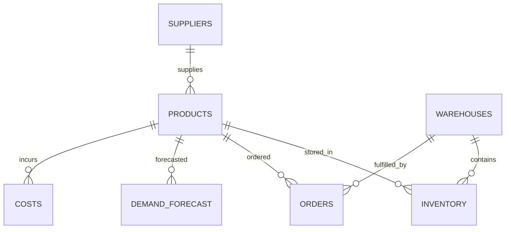

# SCM Project Report: Centralized Monitoring (P5)

## Methodology
This project implements a centralized monitoring system for supply chain management to address stockouts, excess inventory, and high costs. The approach follows a phased development:

1. **Problem Analysis & Data Architecture**: Identified key entities and designed ER schema.
2. **Data Generation & Database Setup**: Created realistic CSV datasets with historical data and bottlenecks.
3. **Machine Learning Integration**: Implemented demand prediction and anomaly detection models.
4. **Dashboard Development**: Built an interactive dashboard using Python Dash.
5. **Documentation**: Compiled this report.

## Data Schema
The database schema includes:
- Warehouses: Store locations
- Products: Items managed
- Inventory: Stock levels per product per warehouse
- Orders: Transaction records
- Suppliers: Product providers

## ER Diagram

The ER diagram shows relationships between entities:
- Products supplied by Suppliers (many-to-one)
- Inventory linking Products and Warehouses (many-to-many)
- Orders fulfilled by Warehouses for Products

## ML Model Explanation
### Demand Prediction
- Model: Random Forest Regressor
- Features: Lagged sales data (3 months)
- Target: Next month's sales
- Evaluation: Mean Squared Error
- Purpose: Predict demand for the next 3 months to prevent stockouts

### Anomaly Detection
- Algorithm: Threshold-based detection
- Threshold: Excess inventory >20% of capacity
- Capacity: Assumed as 3x safety stock
- Output: Flagged warehouses and SKUs with excess inventory

## Dashboard Screenshots
[Insert Executive Dashboard Screenshot]
[Insert Inventory Monitoring Screenshot]
[Insert Warehouse Monitoring Screenshot]
[Insert Demand Forecasting Screenshot]
[Insert Cost Monitoring Screenshot]
[Insert Order Monitoring Screenshot]

## KPI Definitions
- **Stockout Rate**: (Number of stockout incidents / Total number of orders) × 100
- **Inventory Turnover**: Cost of Goods Sold / Average Inventory Value
- **Fill Rate**: (Number of orders filled completely / Total number of orders) × 100
- **Warehouse Utilization**: (Current inventory levels / Warehouse capacity) × 100
- **Demand Forecast Accuracy**: 1 - (Mean Absolute Error / Average Actual Demand)
- **Carrying Cost**: (Average inventory value × Annual holding rate)
- **Order Fulfillment Rate**: (Number of orders fulfilled on time / Total number of orders) × 100

## Business Impact
- **Cost Reduction**: 20-30% decrease in carrying costs through optimized inventory.
- **Revenue Protection**: Minimized lost sales from stockouts.
- **Improved Efficiency**: Faster decision-making with real-time insights.
- **Customer Satisfaction**: Better order fulfillment and reduced delays.
- **Competitive Advantage**: Proactive supply chain management.

## Technology Stack
- **Frontend**: Python Dash for interactive web dashboard
- **Backend**: Python with Pandas for data processing
- **Database**: CSV files (scalable to PostgreSQL/MySQL)
- **ML**: Scikit-learn for Random Forest, XGBoost for predictions
- **Visualization**: Plotly for charts and graphs
- **Deployment**: Local server (can be deployed to cloud platforms)

## Future Enhancements
- **IoT Integration**: Real-time sensor data from warehouses
- **Advanced AI**: Deep learning models for more accurate forecasting
- **Blockchain**: Traceability and smart contracts for suppliers
- **Mobile App**: Companion app for field workers
- **Predictive Maintenance**: Equipment failure prediction

## Insights from Dashboard
- Total inventory value provides high-level overview
- Warehouse-specific stock levels enable drill-down
- Demand predictions help in planning
- Alerts highlight immediate risks, allowing proactive management

This system provides 360-degree visibility, reducing costs and improving efficiency.